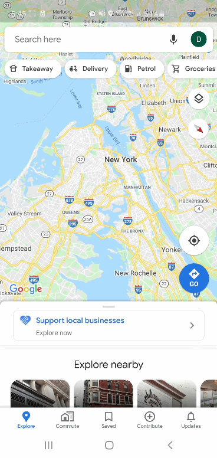
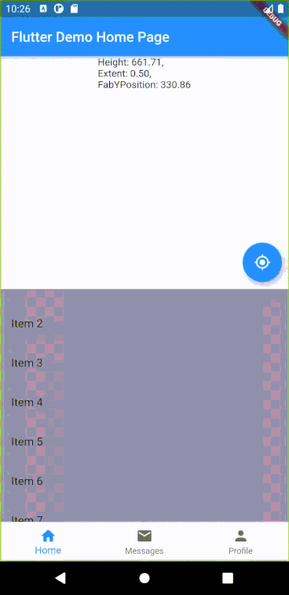

# dragscrollsheet_with_fixed_fab

Dragable Scrollable Sheet with fixed Floating Action Button Hovering on top

##

This is the source code for my medium article on how to create a Google Map like drag-able bottom sheet with a hovering floating action button

link: https://medium.com/@danialtham/draggablescrollablesheet-with-hovering-floating-action-button-b809490dc205

 /   / 

